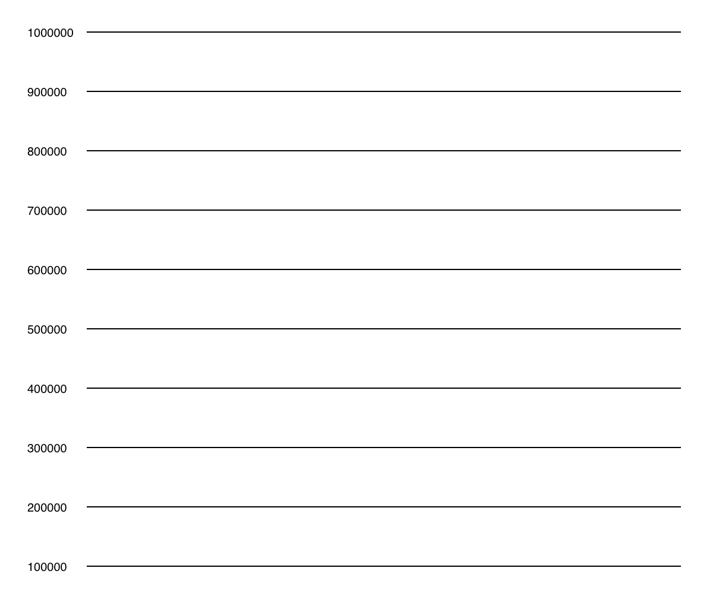
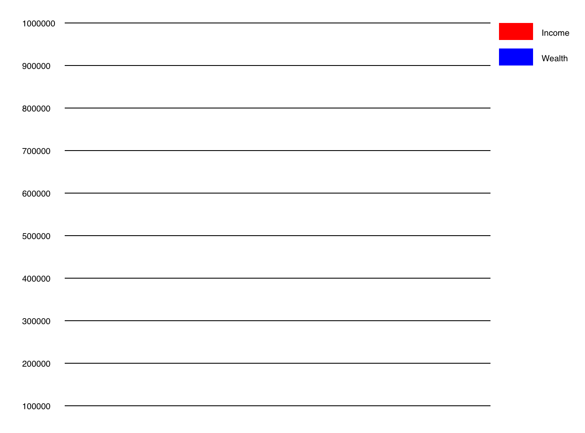

# Assignment 8: Canvas

The Norwegian Tax Administration wants an easy way of visualizing the tax and income of superheros. In this exercise you are going to use the canvas element to create a bar chart from Javascript objects stored on a webserver. Related theory to the canvas tasks can be found in the [HTML Canvas chapter](https://it2805.gitbooks.io/curriculum/content/canvas.html) of the curriculum.

## Part 1: Filter objects in an array (10%)
This exercise will give you a feel for how to iterate over an array of objects in Javascript.

In ````income-greather-than-500k.html```` you will find an array of tax forms assigned to the variable called ````taxForms````.  

In its current state the entire array is logged to the console. You need to change the Javascript in ````income-greather-than-500k.html```` such that the array is iterated and **only the real name** of the superheroes that have an income greater than 500 000 are logged with ````console.log````.

## Part 2: Create lines with Canvas (25%)
Although ````console.log```` is practical for debugging, it is not very helpful when you want to visualize data. Luckily HTML5 let's us programmatically generate images directly in the browser. In this exercise you are going to programmatically recreate the image below using the Canvas element and its methods.

The file called ````bar-chart-with-lines.html```` provides you with some convenient functions for drawing lines and text on the canvas.

You do not have to worry about the lines not being *identical* to the image . However, there has to be 10 lines and they need to have the same values on the y-axis as seen in the image. The lines should be drawn from a for loop, and not from 10 function calls with hard coded coordinates.



## Part 3: Create labels with Canvas (25%)

Reuse the code from ````bar-chart-with-lines.html```` and save it as ````bar-chart-with-labels.html````.

In this file you need to create labels for what will ultimately be the colors of the bars. Try to replicate the image below. 

Hint: If you write a function for creating rectangles that takes color, coordinates, width and height of the rectangle as parameters, you can reuse that function in part 4 of this assignment. To specify the color of the rectangle you can use ````context.fillStyle = color;````, and to draw the rectangle you can use ````context.fillRect(x, y, width, height);````.



## Part 4: Draw bars with Canvas (25%)
Now it is time to draw the actual bars. Create a new file called ````bar-chart-with-bars.html````. Copy over the code from ````bar-chart-with-labels.html````.

Iterate over the tax forms in the ````taxForms```` variable and draw rectangles so that their height and color correspond to the income and wealth of each superhero. You do not need to show the name of the superhero below the rectangles.

Note that your code only needs to handle exactly three tax forms at a time.

The end result should look something like this:


## Questions (15%)
1. When calling ````getContext('2d')```` on a Canvas element, it will return a drawing context (i.e. the type of canvas) - in this case a two-dimensional context. How can we get a three-dimensional context instead?
2. How would you create a blue circle using the Canvas element? Explain with words or code.
3. What is a more terse (also known as shorter) way of writing the loop in the following using the ````Array.filter```` method?


````javascript
const countries = ['Norway', 'Sweden',  'Denmark', 'New Zealand'];
const countriesStartingWithN = [];

for (let i = 0; i < countries.length; i++) {
  let country = countries[i];
  if (country.startsWith('N')) {
    countriesStartingWithN.push(country);
  }
}
````

Deliver the answers as a .txt file together with your other deliverables. 

## Deliverables
Submission should be uploaded as a zip file into Blackboard before the deadline. Submissions are ONLY accepted via Blackboard. We DON’T accept late assignments. Emails or any other messages with late assignments are automatically discarded without further communication.
